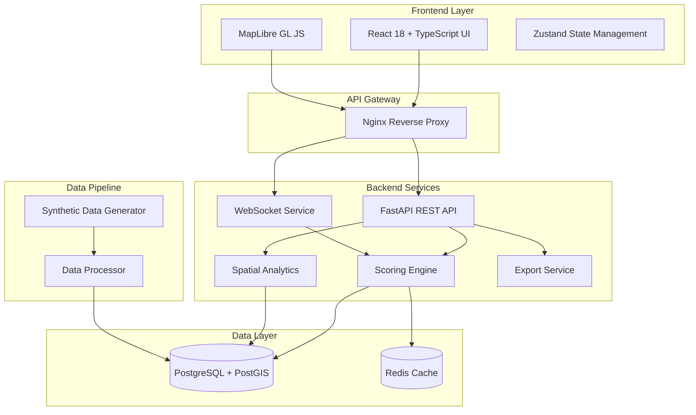
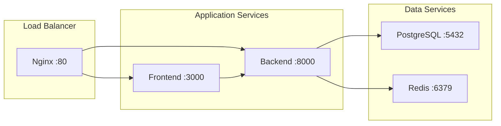

# Design Document: GeoSpatial Site Readiness Analyzer

## Overview

The GeoSpatial Site Readiness Analyzer is a comprehensive AI-powered location intelligence platform designed for commercial real estate and infrastructure site selection. The system provides sophisticated spatial analysis capabilities to evaluate and compare potential sites based on multiple geospatial data layers, enabling data-driven decision making across various industries including retail, logistics, telecommunications, and energy infrastructure.

### Key Capabilities

- **Real-time Site Scoring**: Sub-200ms composite scoring for any geographic location using configurable weighted algorithms
- **Interactive Spatial Visualization**: MapLibre GL JS-based mapping interface with 10+ toggleable data layers
- **Advanced Spatial Analytics**: DBSCAN clustering, Getis-Ord Gi* hotspot detection, and H3 hexagonal binning
- **Real-time Progress Streaming**: WebSocket-based progress updates for long-running spatial computations
- **Multi-site Comparison**: Side-by-side analysis of up to 5 candidate locations with ranking and visualization
- **Industry-specific Presets**: Configurable scoring weights for retail, EV charging, warehouse, and telecom use cases
- **Comprehensive Reporting**: PDF report generation and CSV data export capabilities

### Study Area

The system focuses on the Ahmedabad metropolitan area in Gujarat, India, with comprehensive synthetic geospatial data covering:
- 200 demographic zones with population and socioeconomic indicators
- Realistic road network topology with highways, arterials, and collectors
- 500 points of interest including competitors, anchors, and services
- 150 land use zoning polygons covering commercial, residential, industrial, and mixed-use areas
- Environmental risk layers including flood zones, earthquake PGA values, and air quality indices

## Architecture

### System Architecture Overview

The system follows a modern microservices architecture with clear separation of concerns:



### Technology Stack

**Frontend Stack:**
- **React 18**: Modern component-based UI framework with concurrent features
- **TypeScript**: Type-safe development with enhanced IDE support
- **Vite**: Fast build tool with hot module replacement
- **Tailwind CSS**: Utility-first CSS framework for rapid UI development
- **MapLibre GL JS**: High-performance vector map rendering with WebGL
- **Zustand**: Lightweight state management for React applications

**Backend Stack:**
- **FastAPI**: High-performance Python web framework with automatic API documentation
- **PostgreSQL 15**: Advanced relational database with robust spatial capabilities
- **PostGIS 3.3**: Spatial database extension for geographic objects and operations
- **Redis 7**: In-memory data structure store for caching and session management
- **SQLAlchemy**: Python SQL toolkit and Object-Relational Mapping (ORM)
- **Pydantic**: Data validation and settings management using Python type annotations

**Spatial Analytics Stack:**
- **GeoPandas**: Python library for geospatial data manipulation and analysis
- **Shapely**: Python package for manipulation and analysis of planar geometric objects
- **H3-py**: Python bindings for Uber's H3 hexagonal hierarchical geospatial indexing system
- **Scikit-learn**: Machine learning library for clustering and statistical analysis
- **SciPy**: Scientific computing library for advanced mathematical operations

**Infrastructure:**
- **Docker**: Containerization platform for consistent deployment environments
- **Docker Compose**: Multi-container application orchestration
- **Nginx**: High-performance web server and reverse proxy

### Deployment Architecture

The system is fully containerized with the following service topology:



## Components and Interfaces

### Frontend Components

#### MapContainer Component
**Purpose**: Core mapping interface providing interactive geospatial visualization

**Key Features:**
- MapLibre GL JS integration with custom styling
- Click-based site scoring with popup display
- Layer management for hex grids, isochrones, and POI data
- Drawing tools for polygon-based area analysis
- Real-time data updates via WebSocket connections

**State Management:**
- Map instance and viewport state (center, zoom, bearing)
- Clicked point coordinates and active selections
- Drawn polygon geometries for area analysis

#### SidebarPanel Component
**Purpose**: Primary control interface for analysis configuration and results display

**Sub-components:**
- **WeightControls**: Configurable sliders for layer weight adjustment
- **LayerManager**: Toggle controls for map layer visibility and opacity
- **SiteComparison**: Multi-site comparison table with ranking and metrics
- **ScoreGauge**: Visual representation of composite scores with color coding

#### State Management Architecture

**Zustand Stores:**
- **mapStore**: Map instance, viewport state, and user interactions
- **layerStore**: Layer visibility, opacity, and styling configuration
- **scoreStore**: Active scores, loading states, and calculation results
- **comparisonStore**: Multi-site comparison data and rankings

### Backend Services

#### Site Scoring Engine
**Purpose**: Core computational service for location readiness assessment

**Algorithm Components:**

1. **Demographics Scoring (35% default weight)**
   - Population density normalization using min-max scaling
   - Median income assessment relative to study area statistics
   - Working-age population percentage evaluation
   - Composite calculation: `density * 0.5 + income * 0.3 + working_age * 0.2`

2. **Transport Accessibility Scoring (25% default weight)**
   - Distance decay function for highway access: `1 / (1 + decay_rate * distance_km)`
   - Arterial road proximity with higher decay rate
   - Local road density within 1km radius
   - Composite calculation: `highway_score * 0.5 + arterial_score * 0.3 + density_score * 0.2`

3. **POI Density Scoring (20% default weight)**
   - Competitor analysis with distance-based penalties
   - Anchor tenant proximity bonuses
   - Service accessibility evaluation
   - Optimal competition threshold: 2-10 competitors within 500m

4. **Land Use Compatibility Scoring (10% default weight)**
   - Zoning type compatibility matrix
   - Floor Area Ratio (FAR) bonuses
   - Development restriction penalties
   - Commercial zones: 100 points, Mixed-use: 70 points, Residential: 30 points

5. **Environmental Risk Scoring (10% default weight)**
   - Flood zone severity penalties
   - Air Quality Index (AQI) assessment
   - Earthquake risk evaluation
   - Composite environmental safety score

**Performance Optimizations:**
- Spatial index utilization for all geometric queries
- Statistics caching to avoid repeated calculations
- Batch processing support for up to 1000 locations
- Redis caching for frequently accessed spatial data

#### Spatial Analytics Service
**Purpose**: Advanced spatial analysis and pattern detection

**DBSCAN Clustering:**
- Configurable epsilon (distance) and min_samples parameters
- POI clustering for market analysis
- Demographic zone clustering for socioeconomic patterns
- Performance target: <2 seconds for 1000+ points

**Getis-Ord Gi* Hotspot Analysis:**
- Statistical significance testing at 95% confidence level
- Spatial autocorrelation detection
- Hot and cold spot identification
- Z-score calculation for statistical validity

**H3 Hexagonal Binning:**
- Multi-resolution support (levels 7-9)
- Spatial aggregation of point data
- Uniform area analysis capabilities
- Integration with scoring engine for hex-level analysis

#### WebSocket Service
**Purpose**: Real-time communication for long-running spatial computations

**Message Protocol:**
```typescript
interface WebSocketMessage {
  action: 'start_hex_analysis' | 'progress_update' | 'analysis_complete' | 'error'
  data: {
    progress?: number
    total?: number
    current_hex?: string
    results?: GeoJSONFeatureCollection
    error_message?: string
  }
}
```

**Progress Streaming:**
- 10% increment progress updates
- Hex-by-hex computation status
- Error handling and recovery
- Connection management for up to 25 concurrent sessions

### API Design

#### REST API Endpoints

**Scoring Endpoints:**
```
POST /api/score/point
  Body: { lat: number, lng: number, weights?: object, use_case?: string }
  Response: ScoreResponse with composite and sub-scores

POST /api/score/batch
  Body: { points: Array<{lat, lng}>, weights?: object }
  Response: Array<ScoreResponse>

GET /api/score/hex-grid/{resolution}
  Query: ?use_case=retail&weights=custom
  Response: GeoJSON FeatureCollection with scored hexagons
```

**Spatial Analysis Endpoints:**
```
POST /api/spatial/clusters
  Body: { algorithm: 'dbscan', eps: number, min_samples: number }
  Response: GeoJSON with cluster assignments

POST /api/spatial/hotspots
  Body: { layer: string, confidence: number }
  Response: GeoJSON with Gi* statistics

POST /api/spatial/isochrones
  Body: { lat: number, lng: number, modes: string[], minutes: number[] }
  Response: GeoJSON with accessibility polygons
```

**Site Management Endpoints:**
```
POST /api/sites/save
  Body: SaveSiteRequest
  Response: CandidateSiteResponse

GET /api/sites/compare
  Query: ?site_ids=1,2,3
  Response: CompareSitesResponse with rankings

POST /api/export/pdf
  Body: { site_ids: number[], include_maps: boolean }
  Response: PDF file stream
```

#### WebSocket API

**Connection Endpoint:** `/ws/realtime`

**Supported Actions:**
- `start_hex_analysis`: Initiate hex grid computation
- `subscribe_progress`: Subscribe to analysis progress updates
- `cancel_analysis`: Cancel ongoing computation

## Data Models

### Database Schema Design

#### Core Spatial Tables

**demographic_zones**
```sql
CREATE TABLE demographic_zones (
    id SERIAL PRIMARY KEY,
    zone_id VARCHAR(50) UNIQUE NOT NULL,
    name VARCHAR(200),
    geom GEOMETRY(MULTIPOLYGON, 4326) NOT NULL,
    population INTEGER,
    population_density FLOAT,
    median_income FLOAT,
    median_age FLOAT,
    youth_population_pct FLOAT,
    working_age_pct FLOAT,
    household_count INTEGER,
    data_year INTEGER DEFAULT 2023,
    created_at TIMESTAMP DEFAULT NOW()
);

CREATE INDEX idx_demographic_zones_geom ON demographic_zones USING GIST (geom);
CREATE INDEX idx_demographic_zones_zone_id ON demographic_zones (zone_id);
```

**road_network**
```sql
CREATE TABLE road_network (
    id SERIAL PRIMARY KEY,
    osm_id NUMERIC(20),
    road_type VARCHAR(50),
    name VARCHAR(200),
    geom GEOMETRY(LINESTRING, 4326) NOT NULL,
    lanes INTEGER,
    max_speed INTEGER,
    is_highway BOOLEAN DEFAULT FALSE,
    created_at TIMESTAMP DEFAULT NOW()
);

CREATE INDEX idx_road_network_geom ON road_network USING GIST (geom);
CREATE INDEX idx_road_network_type ON road_network (road_type);
CREATE INDEX idx_road_network_highway ON road_network (is_highway);
```

**points_of_interest**
```sql
CREATE TABLE points_of_interest (
    id SERIAL PRIMARY KEY,
    poi_id VARCHAR(100) UNIQUE,
    name VARCHAR(300),
    category VARCHAR(100),
    subcategory VARCHAR(100),
    geom GEOMETRY(POINT, 4326) NOT NULL,
    brand VARCHAR(200),
    is_competitor BOOLEAN DEFAULT FALSE,
    is_anchor BOOLEAN DEFAULT FALSE,
    rating FLOAT,
    review_count INTEGER,
    created_at TIMESTAMP DEFAULT NOW()
);

CREATE INDEX idx_poi_geom ON points_of_interest USING GIST (geom);
CREATE INDEX idx_poi_category ON points_of_interest (category);
CREATE INDEX idx_poi_competitor ON points_of_interest (is_competitor);
CREATE INDEX idx_poi_anchor ON points_of_interest (is_anchor);
```

#### Analysis Results Tables

**h3_hex_scores**
```sql
CREATE TABLE h3_hex_scores (
    h3_index VARCHAR(20) PRIMARY KEY,
    h3_resolution INTEGER DEFAULT 8,
    center_lat FLOAT,
    center_lng FLOAT,
    composite_score FLOAT,
    score_breakdown JSONB,
    is_hotspot BOOLEAN DEFAULT FALSE,
    is_coldspot BOOLEAN DEFAULT FALSE,
    gi_star_value FLOAT,
    cluster_label INTEGER,
    population_in_hex INTEGER,
    computed_at TIMESTAMP DEFAULT NOW()
);

CREATE INDEX idx_h3_hex_scores_resolution ON h3_hex_scores (h3_resolution);
CREATE INDEX idx_h3_hex_scores_score ON h3_hex_scores (composite_score);
CREATE INDEX idx_h3_hex_scores_hotspot ON h3_hex_scores (is_hotspot);
```

**candidate_sites**
```sql
CREATE TABLE candidate_sites (
    id SERIAL PRIMARY KEY,
    site_name VARCHAR(300),
    description TEXT,
    geom GEOMETRY(POINT, 4326) NOT NULL,
    latitude FLOAT NOT NULL,
    longitude FLOAT NOT NULL,
    composite_score FLOAT,
    score_breakdown JSONB,
    weights_used JSONB,
    isochrone_10min GEOMETRY(POLYGON, 4326),
    isochrone_20min GEOMETRY(POLYGON, 4326),
    isochrone_30min GEOMETRY(POLYGON, 4326),
    catchment_pop_10min INTEGER,
    catchment_pop_20min INTEGER,
    catchment_pop_30min INTEGER,
    created_at TIMESTAMP DEFAULT NOW(),
    updated_at TIMESTAMP DEFAULT NOW()
);

CREATE INDEX idx_candidate_sites_geom ON candidate_sites USING GIST (geom);
CREATE INDEX idx_candidate_sites_score ON candidate_sites (composite_score);
```

### Data Validation and Constraints

**Spatial Data Validation:**
- All geometries must be valid (ST_IsValid = true)
- Coordinate bounds validation for study area (72.45-72.75°E, 22.87-23.15°N)
- Topology checks for polygon data (no self-intersections)

**Business Logic Constraints:**
- Composite scores must be between 0-100
- Layer weights must sum to 1.0 (100%)
- H3 resolution must be between 7-9
- Population values must be non-negative

### Caching Strategy

**Redis Cache Structure:**
```
spatial:scores:{lat}:{lng}:{weights_hash} -> ScoreResponse (TTL: 1 hour)
spatial:hex_grid:{resolution}:{use_case} -> GeoJSON (TTL: 24 hours)
spatial:isochrones:{lat}:{lng}:{mode}:{minutes} -> GeoJSON (TTL: 6 hours)
stats:demographics -> Statistics object (TTL: 24 hours)
```

**Cache Invalidation:**
- Score cache invalidated on weight configuration changes
- Hex grid cache invalidated on data updates
- Statistics cache invalidated on demographic data changes
## Correctness Properties

*A property is a characteristic or behavior that should hold true across all valid executions of a system-essentially, a formal statement about what the system should do. Properties serve as the bridge between human-readable specifications and machine-verifiable correctness guarantees.*

### Property 1: Score Range Validation

*For any* valid coordinate within the study area, the composite score returned by the Site_Scoring_Engine should always be between 0 and 100 inclusive, and individual layer scores should also be within this range.

**Validates: Requirements 1.1**

### Property 2: Layer Score Completeness

*For any* scoring request, the response should contain exactly five individual layer scores (demographics, transport, poi, land_use, environment) and their weighted combination should equal the composite score within floating-point precision.

**Validates: Requirements 1.2, 1.4**

### Property 3: Weight Configuration Impact

*For any* location and two different weight configurations, if the weights differ, then at least one of the composite score or individual layer contributions should differ in the results.

**Validates: Requirements 1.3**

### Property 4: Batch Processing Consistency

*For any* set of coordinates processed individually versus as a batch with identical weights, the resulting scores should be equivalent within floating-point precision.

**Validates: Requirements 1.5**

### Property 5: Map Click Response

*For any* valid map click within the study area bounds, the Interactive_Map should generate a score request and display results within the specified time limit.

**Validates: Requirements 2.3**

### Property 6: Hex Grid Color Mapping

*For any* hex grid visualization, hexagons with higher composite scores should have colors that represent higher values in the color scale (green spectrum for high scores, red spectrum for low scores).

**Validates: Requirements 2.4**

### Property 7: Layer Toggle Responsiveness

*For any* layer visibility toggle action, the map display should update within 100ms to reflect the new visibility state.

**Validates: Requirements 2.6**

### Property 8: WebSocket Connection Establishment

*For any* hex grid analysis request, a WebSocket connection should be successfully established before computation begins, and the connection should remain active throughout the analysis.

**Validates: Requirements 3.1**

### Property 9: Progress Update Frequency

*For any* hex grid computation, progress updates should be sent at regular intervals, with the total number of updates being proportional to the computation complexity.

**Validates: Requirements 3.2**

### Property 10: Hex Grid Performance

*For any* H3 resolution 8 hex grid analysis within the study area, the computation should complete within 5 seconds under normal system load.

**Validates: Requirements 3.3**

### Property 11: WebSocket Result Delivery

*For any* completed hex grid analysis, the final results should be delivered via WebSocket as a valid GeoJSON FeatureCollection with scored hexagons.

**Validates: Requirements 3.4**

### Property 12: WebSocket Error Handling

*For any* analysis that encounters an error, the WebSocket should send an error message with descriptive details and ensure no partial results remain in the system.

**Validates: Requirements 3.5**

### Property 13: DBSCAN Clustering Validity

*For any* valid DBSCAN parameters (eps > 0, min_samples > 0), the clustering algorithm should return valid cluster assignments where each point is either assigned to a cluster (non-negative integer) or marked as noise (-1).

**Validates: Requirements 4.1**

### Property 14: Hotspot Statistical Significance

*For any* Getis-Ord Gi* analysis, identified hotspots should have z-scores that exceed the 95% confidence threshold (|z| > 1.96).

**Validates: Requirements 4.2, 4.5**

### Property 15: Clustering Performance

*For any* clustering request with reasonable data size (< 10,000 points), the analysis should complete within 2 seconds.

**Validates: Requirements 4.3**

### Property 16: H3 Hexagonal Binning

*For any* point dataset and H3 resolution level, the hexagonal binning should assign each point to exactly one hexagon, and the total count across all hexagons should equal the input point count.

**Validates: Requirements 4.4**

### Property 17: Isochrone Generation Completeness

*For any* isochrone request with specified time intervals, the service should generate exactly one polygon for each requested interval and mode combination.

**Validates: Requirements 5.1, 5.2**

### Property 18: Population Catchment Calculation

*For any* generated isochrone polygon, the calculated population catchment should be non-negative and represent the sum of population within the polygon boundaries.

**Validates: Requirements 5.3**

### Property 19: Isochrone Performance

*For any* single-point isochrone analysis, the computation should complete within 3 seconds regardless of the number of time intervals requested.

**Validates: Requirements 5.5**

### Property 20: Site Comparison Limits

*For any* site comparison request, the system should accept up to 5 sites and reject requests with more than 5 sites with an appropriate error message.

**Validates: Requirements 6.1**

### Property 21: Comparison Data Completeness

*For any* valid site comparison, the response should include scores, layer breakdowns, and key metrics for each site in a structured format.

**Validates: Requirements 6.2**

### Property 22: Site Ranking Consistency

*For any* set of sites with different composite scores, the ranking should order sites from highest to lowest composite score consistently.

**Validates: Requirements 6.3**

### Property 23: Radar Chart Generation

*For any* site comparison, radar charts should be generated with data points for all five scoring layers, and the chart should accurately represent the relative performance across dimensions.

**Validates: Requirements 6.4**

### Property 24: Comparison Update Performance

*For any* change to comparison data (adding/removing sites, changing weights), the rankings and visualizations should update within 500ms.

**Validates: Requirements 6.5**

### Property 25: Preset Weight Application

*For any* industry preset selection, the system should apply the corresponding predefined weights and the resulting composite scores should reflect the new weight distribution.

**Validates: Requirements 7.2**

### Property 26: Custom Weight Validation

*For any* custom weight configuration, the system should validate that all weights are non-negative and sum to 100% (1.0) before accepting the configuration.

**Validates: Requirements 7.5**

### Property 27: Weight Change Responsiveness

*For any* weight modification, all displayed scores should be recalculated and updated within 1 second.

**Validates: Requirements 7.4**

### Property 28: PDF Report Content

*For any* PDF report generation request, the resulting document should contain site scores, maps, analysis charts, executive summary, methodology, and detailed findings sections.

**Validates: Requirements 8.1, 8.3**

### Property 29: CSV Export Completeness

*For any* CSV export request, the resulting file should contain coordinates, composite scores, individual layer scores, and metadata for each requested site.

**Validates: Requirements 8.2**

### Property 30: Export Performance

*For any* standard report generation (up to 10 sites), the export should complete within 10 seconds, and batch exports should handle up to 100 sites successfully.

**Validates: Requirements 8.4, 8.5**

### Property 31: Concurrent User Support

*For any* system load with up to 100 concurrent users, the Site_Scoring_Engine should maintain response times under 200ms for single point scoring requests.

**Validates: Requirements 10.1, 10.2**

### Property 32: WebSocket Concurrency

*For any* system state with up to 25 concurrent WebSocket connections, all connections should remain stable and receive appropriate progress updates.

**Validates: Requirements 10.4**

### Property 33: Spatial Index Utilization

*For any* geospatial query executed by the system, the query execution plan should utilize spatial indexes (GIST indexes) for optimal performance.

**Validates: Requirements 10.5**

### Property 34: System Startup Performance

*For any* docker-compose deployment, all services should be healthy and ready for use within 2 minutes of startup initiation.

**Validates: Requirements 11.2**

### Property 35: Health Check Functionality

*For any* system service, the health check endpoint should return a successful status when the service is operational and an error status when the service is unavailable.

**Validates: Requirements 11.5**

### Property 36: Data Format Processing

*For any* supported geospatial data format (GeoJSON, Shapefile, CSV with coordinates), the Data_Pipeline should successfully ingest and process the data without errors.

**Validates: Requirements 12.1**

### Property 37: Coordinate System Transformation

*For any* input data with valid coordinate system information, the Data_Pipeline should transform all coordinates to WGS84 (EPSG:4326) consistently.

**Validates: Requirements 12.2**

### Property 38: Geospatial Data Validation

*For any* input geospatial data, the Data_Pipeline should validate geometry integrity and reject invalid geometries with descriptive error messages.

**Validates: Requirements 12.3**

### Property 39: Spatial Index Creation

*For any* geographic column created by the Data_Pipeline, a corresponding spatial index should be automatically created to optimize query performance.

**Validates: Requirements 12.4**

### Property 40: Data Processing Logging

*For any* completed data processing operation, the system should log summary statistics including record counts, processing time, and any data quality issues encountered.

**Validates: Requirements 12.5**

### Property 41: Polygon Drawing Validation

*For any* completed polygon drawn using the drawing tools, the resulting geometry should be a valid, closed, non-self-intersecting polygon.

**Validates: Requirements 13.1, 13.2**

### Property 42: Area-based Site Analysis

*For any* user-drawn polygon, the Site_Scoring_Engine should identify and return the highest-scoring locations within the polygon boundaries along with summary statistics.

**Validates: Requirements 13.3, 13.4**

### Property 43: Visual Site Highlighting

*For any* polygon-based analysis results, the Interactive_Map should visually highlight the best sites within the polygon using distinct visual indicators.

**Validates: Requirements 13.5**

### Property 44: Configuration Parsing Round-trip

*For any* valid Configuration object, parsing then printing then parsing should produce an equivalent object (round-trip property).

**Validates: Requirements 14.4**

### Property 45: Configuration Validation

*For any* configuration input, the Configuration_Parser should validate all required fields and data types, accepting valid configurations and rejecting invalid ones with descriptive error messages.

**Validates: Requirements 14.1, 14.2, 14.5**

## Error Handling

### Error Classification

**Client Errors (4xx):**
- **400 Bad Request**: Invalid coordinates, malformed request bodies, invalid weight configurations
- **404 Not Found**: Non-existent site IDs, missing resources
- **422 Unprocessable Entity**: Valid JSON but invalid business logic (e.g., weights don't sum to 100%)
- **429 Too Many Requests**: Rate limiting for expensive operations

**Server Errors (5xx):**
- **500 Internal Server Error**: Database connection failures, unexpected computation errors
- **503 Service Unavailable**: System overload, maintenance mode
- **504 Gateway Timeout**: Long-running operations that exceed timeout limits

### Error Response Format

```json
{
  "error": {
    "code": "INVALID_COORDINATES",
    "message": "Coordinates must be within study area bounds",
    "details": {
      "provided": {"lat": 25.0, "lng": 75.0},
      "valid_bounds": {
        "min_lat": 22.87, "max_lat": 23.15,
        "min_lng": 72.45, "max_lng": 72.75
      }
    },
    "timestamp": "2024-01-15T10:30:00Z"
  }
}
```

### Spatial Data Error Handling

**Invalid Geometries:**
- Detect self-intersecting polygons using ST_IsValid()
- Handle coordinate system mismatches with automatic detection
- Validate coordinate bounds for study area constraints

**Database Connection Failures:**
- Implement connection pooling with automatic retry
- Graceful degradation with cached results when possible
- Circuit breaker pattern for database operations

**Computation Timeouts:**
- Configurable timeout limits for different operation types
- Progress tracking for long-running operations
- Ability to cancel operations via WebSocket

### WebSocket Error Handling

**Connection Management:**
- Automatic reconnection with exponential backoff
- Heartbeat mechanism to detect stale connections
- Graceful handling of network interruptions

**Analysis Failures:**
- Partial result cleanup on computation errors
- Error state communication to clients
- Recovery mechanisms for interrupted analyses

## Testing Strategy

### Dual Testing Approach

The system employs a comprehensive testing strategy combining unit tests and property-based tests to ensure correctness and robustness:

**Unit Tests:**
- Focus on specific examples, edge cases, and integration points
- Test concrete scenarios with known expected outcomes
- Validate error conditions and boundary cases
- Cover component integration and API contract validation

**Property-Based Tests:**
- Verify universal properties across all valid inputs
- Use randomized input generation for comprehensive coverage
- Test invariants and mathematical properties of algorithms
- Validate system behavior under various load conditions

### Property-Based Testing Configuration

**Testing Framework:** Hypothesis (Python) for backend services, fast-check (TypeScript) for frontend components

**Test Configuration:**
- Minimum 100 iterations per property test to ensure statistical confidence
- Custom generators for geospatial data (coordinates, polygons, realistic demographic data)
- Shrinking strategies to find minimal failing examples
- Timeout configuration for performance-related properties

**Property Test Tagging:**
Each property-based test must include a comment referencing its corresponding design document property:
```python
# Feature: geospatial-site-analyzer, Property 1: Score Range Validation
@given(coordinates=valid_study_area_coordinates())
def test_score_range_property(coordinates):
    # Test implementation
```

### Test Data Management

**Synthetic Data Generation:**
- Deterministic seed-based generation for reproducible tests
- Realistic geospatial patterns matching Ahmedabad characteristics
- Configurable data density and distribution parameters
- Separate test datasets for different scenarios (urban, suburban, industrial)

**Test Database Management:**
- Isolated test database instances for each test suite
- Automatic schema migration and data seeding
- Cleanup procedures to prevent test interference
- Performance benchmarking with consistent baseline data

### Performance Testing

**Load Testing:**
- Concurrent user simulation up to specified limits (100 users)
- WebSocket connection stress testing (25 concurrent sessions)
- Database query performance under load
- Memory usage and garbage collection monitoring

**Benchmark Testing:**
- Response time measurement for critical operations
- Throughput testing for batch operations
- Spatial query performance optimization validation
- Cache hit rate monitoring and optimization

### Integration Testing

**API Integration:**
- End-to-end workflow testing from frontend to database
- WebSocket communication validation
- Error propagation and handling across service boundaries
- Authentication and authorization flow testing

**Spatial Data Integration:**
- PostGIS extension functionality validation
- Coordinate system transformation accuracy
- Spatial index utilization verification
- Data pipeline integration with live database

### Continuous Integration

**Automated Testing Pipeline:**
- Unit test execution on every commit
- Property-based test execution with extended iteration counts
- Performance regression detection
- Code coverage reporting with minimum thresholds

**Quality Gates:**
- All tests must pass before deployment
- Code coverage minimum of 85% for critical components
- Performance benchmarks must meet specified thresholds
- Security vulnerability scanning for dependencies

This comprehensive testing strategy ensures system reliability, performance, and correctness across all operational scenarios while maintaining development velocity through automated validation processes.